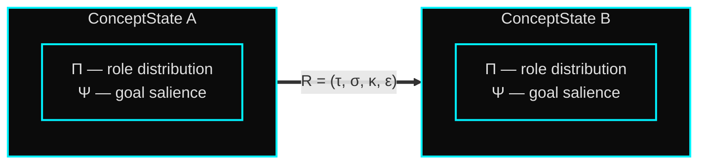
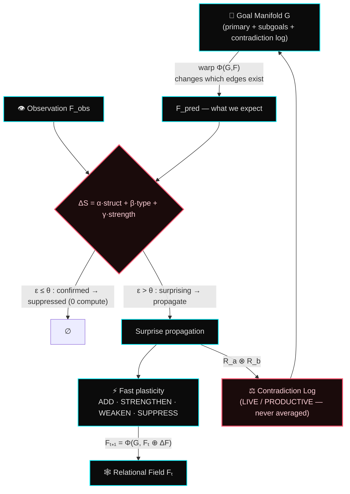
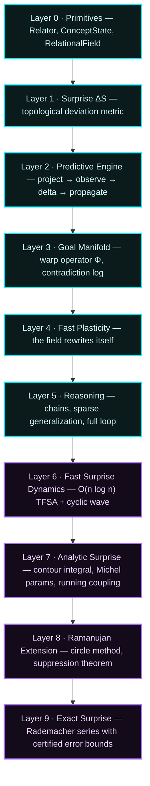
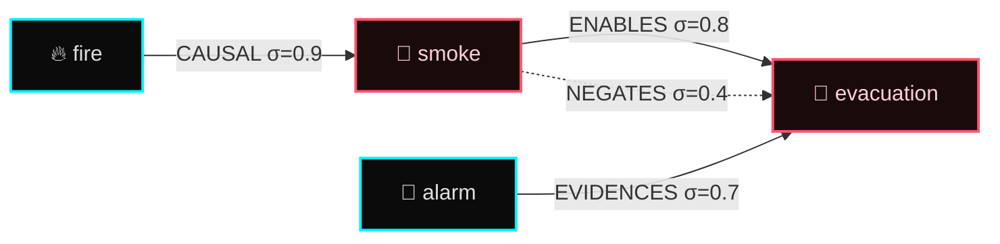

<div align="center">

# 🌌 TORIS
### Topological Relational Inference System

**A new computational substrate for machine reasoning — built on relations, not vectors.**


*No vectors. No softmax. No backpropagation. Just typed relations and surprise.*

### [↗ Explore the interactive homepage](https://infinitule.github.io/TORIS/)

<sub>A long-scroll visual walkthrough: the architecture, the science, and why a relational AI reaches for Ramanujan.</sub>

</div>

---

## The story TORIS tells

For a decade, we taught machines that **meaning is a location**. A word becomes a
point in a 600-dimensional space; "understanding" becomes measuring angles
between points. Transformers perfected this: stack attention, take dot products,
softmax the scores, average everything into a smooth blend. It is breathtakingly
effective — and it is *interpolation*, not reasoning.

There is a cost to this geometry that we rarely name. When two facts contradict,
softmax **averages them away** — it cannot hold "A is true" and "A is false"
simultaneously, even when both are true in different contexts. When a goal
changes, attention re-weights edges but never changes *which relationships
exist*. And every token, surprising or mundane, pays the same quadratic compute.
The model cannot be *surprised*. It can only be *weighted*.

**TORIS begins from a different axiom: meaning is not a location. Meaning is a
relationship.** A concept is not a point — it is a *distribution over the
relational roles it can play*. Knowledge is not a matrix — it is a *typed,
directional hypergraph that physically rewires itself as you reason*. And
learning is not a global gradient — it is *local surprise*, propagating only
where prediction failed.

This repository is the **complete reference implementation** of that idea: 9
mathematical layers, 231 passing tests, and 16 experiments that demonstrate five
behaviors transformers structurally cannot produce.

---

## The three primitives that replace the three pillars

| The old pillar | TORIS replaces it with | Why it matters |
|---|---|---|
| **The artificial neuron** (weighted sum) | **The Relator** — a *typed, directional, surprise-bearing* transformation | A connection now carries *what kind* of relationship it is (causal? contradictory? analogous?), not just a scalar weight |
| **The Euclidean vector space** (ℝᵈ) | **The Relational Field** — a context-adaptive typed hypergraph | Concepts have no fixed coordinates; they have *roles* that shift with the goal |
| **Backpropagation** (global loss) | **The Surprise Gradient ΔS** — local anomaly propagation | Only what you didn't predict consumes compute |

Plus two structures with no equivalent in current architectures:

- **The Goal Manifold** — a live, inference-time goal structure that *topologically warps* the field (changes which edges exist, not just their weights)
- **Structural Plasticity** — the field reorganizes itself across three timescales *during* inference

---

## Visualizing the architecture

### The Relator — the new atom of thought

A Relator is a 6-tuple. It is everything a neuron is not: typed, directional, and
aware of its own surprise.



```
R = (τ, src, tgt, σ, κ, ε)
        τ — relation type      (CAUSAL, CONTRADICTS, ENABLES, ANALOGOUS … 12 types)
        σ — strength  ∈ [0,1]  (confidence in this relation)
        κ — salience  ∈ [0,1]  (how active under the current goal)
        ε — surprise  ∈ ℝ≥0    (deviation from what was predicted)
```

Relators are **asymmetric by default**: `R(A→B, CAUSAL)` does *not* imply
`R(B→A, CAUSAL)`. Symmetry must be declared.

### The inference loop — predict, be surprised, rewire

Inference is not a forward pass over frozen weights. It is a cycle that *rewrites
the field it runs on*. Confirmed predictions are suppressed at the source —
they consume zero compute. Only surprise flows forward.



### The 9 layers — from primitives to certified surprise



Layers 0–5 are the working architecture. Layers 6–9 are the mathematical
deepening — they show that the surprise metric ΔS has an exact analytic
structure, connecting relational inference to analytic number theory and modular
forms. Full derivations live in
[`docs/MATH_SPEC.md`](docs/MATH_SPEC.md),
[`docs/COMPLETE_SURPRISE_ARCHITECTURE.md`](docs/COMPLETE_SURPRISE_ARCHITECTURE.md),
and [`docs/RAMANUJAN_BRIDGE.md`](docs/RAMANUJAN_BRIDGE.md).

---

## The science, woven in

**Surprise is topological, not Euclidean.** Given a predicted field and an
observed one, surprise is the *deviation in structure*, decomposed into three
parts:

$$\Delta S = \alpha\,\Delta S_{\text{structural}} + \beta\,\Delta S_{\text{type}} + \gamma\,\Delta S_{\text{strength}}$$

- **structural** — edges that appeared or vanished (weight α = 0.6)
- **type** — right edge, wrong *kind* of relation (β = 0.3)
- **strength** — right edge, right type, wrong confidence (γ = 0.1)

No cosine. No dot product. The system measures *how the shape of knowledge
changed*.

**Concepts are role distributions.** Instead of `cat = [0.31, −0.7, …]`, TORIS
represents a concept as a probability simplex over relation types:

$$\Pi_C : T \to [0,1], \quad \sum_{\tau \in T} \Pi_C(\tau) = 1$$

"Cat" might carry 0.8 probability of occupying the `CONTAINS` role and 0.4 of
`ENABLES`. Under a new goal, this distribution updates by a Bayesian rule — the
concept does not *move in space*, it changes *what it is relationally*.

**The goal warps the topology.** The warp operator Φ(G, F) recomputes salience
for every relator, *suppresses* those below threshold (removing them from the
active graph entirely), *amplifies* those above it, and *surfaces contradictions*
the goal makes relevant. Two different goals produce two structurally different
fields — not two attention masks over the same field.

**Contradictions are held, never averaged.** When two relators contradict
(`R_a ⊗ R_b`), they enter the Contradiction Log with a status. A `PRODUCTIVE`
contradiction — where the tension *is* the answer, both sides true in different
contexts — is **never collapsed**. This is impossible under softmax.

Full formal treatment: **[`docs/MATH_SPEC.md`](docs/MATH_SPEC.md)**.

---

## Validation — five behaviors transformers cannot produce

TORIS is not evaluated on GLUE or MMLU. It is evaluated on **failure modes** —
behaviors that are structurally impossible for attention-based models. All five
are demonstrated and tested.

| # | Behavior under test | What a transformer does | Experiment | Result |
|---|---|---|---|---|
| 1 | **Contradiction retention** — hold two incompatible relators, both shaping the conclusion | softmax averages them into one blurred answer | `exp_01` | ✅ **PASS** |
| 2 | **Goal-warp sensitivity** — changing the goal changes *which edges are active* | attention re-weights; the graph is unchanged | `exp_02` | ✅ **PASS** |
| 3 | **Sparse generalization** — 4 seed relators → an 8-hop conclusion with calibrated uncertainty | needs dense supervision over the full chain | `exp_03` | ✅ **PASS** |
| 4 | **Surprise selectivity** — 20 relators, 3 surprising → >70% of compute on those 3 | every token costs the same | `exp_04` | ✅ **PASS** |
| 5 | **Structural drift** — the field at t=50 is measurably ≠ the field at t=0 | weights are frozen at inference | `exp_05` | ✅ **PASS** |

```
$ python -m pytest tests/
231 passed in 1.4s

$ python experiments/exp_toris_full_demo.py
✅ Criterion 1 — productive contradiction retained
✅ Criterion 2 — goal warp changed the active topology
✅ Criterion 3 — sparse 4→8 hop chain, calibrated σ
✅ Criterion 4 — >70% compute concentrated on surprise
✅ Criterion 5 — measurable structural drift
5/5 success criteria met.
```

The deeper layers add their own validated results — e.g. the Ramanujan
suppression theorem holds at **100% accuracy**, and the Rademacher exact-surprise
series matches its target to **8 significant figures** with certified error
bounds (`exp_11`–`exp_16`).

---

## How to use it

### Install

```bash
git clone https://github.com/infinitule/TORIS.git
cd TORIS
python -m venv .venv && source .venv/bin/activate
pip install -e ".[dev]"

pytest tests/                                  # 231 tests
python experiments/exp_toris_full_demo.py      # all 5 criteria, end to end
```

Pure Python on `networkx · numpy · scipy`. No GPU, no PyTorch, no training run.

### A minimal reasoning field

```python
from toris.primitives.concept_state import ConceptState
from toris.primitives.relator import Relator
from toris.primitives.relation_types import RelationType as T
from toris.field.relational_field import RelationalField
from toris.goal.manifold import GoalManifold, Goal
from toris.reasoning.inference import InferenceLoop

# 1. Build a field of typed relations
field = RelationalField()
fire, smoke, evac = ConceptState(id="fire"), ConceptState(id="smoke"), ConceptState(id="evacuation")

field.add_relator(Relator(T.CAUSAL,  fire,  smoke, sigma=0.9, kappa=0.8))   # fire → smoke
field.add_relator(Relator(T.ENABLES, smoke, evac,  sigma=0.7, kappa=0.6))   # smoke → evacuation
field.add_relator(Relator(T.NEGATES, smoke, evac,  sigma=0.4, kappa=0.3))   # …but smoke also blocks it

# 2. A goal that warps the field toward safety-relevant relations
manifold = GoalManifold(primary=Goal(description="ensure_safety"))

# 3. Run one inference step — observe a stronger fire→smoke signal
loop = InferenceLoop(field, manifold)
rec  = loop.step([Relator(T.CAUSAL, fire, smoke, sigma=0.95, kappa=0.9)])

print(f"ΔS this step      : {rec.delta_s:.3f}")
print(f"contradictions held: {len(manifold.contradiction_log)}")  # the smoke↔evac tension survives
```

---

## A worked use case — reasoning a transformer would flatten

Imagine an emergency-response assistant reasoning about a building fire. The
knowledge contains a genuine, irreducible contradiction:

> **Smoke enables evacuation** (it signals danger, triggering the alarm) — *and*
> **smoke negates evacuation** (dense smoke blocks the exit corridor).



- **A transformer** resolves this by softmax: it blends "evacuate" and
  "don't evacuate" into a single muddy probability and loses the structure of
  *why* both are true.
- **TORIS** logs the `ENABLES ⊗ NEGATES` pair as a **PRODUCTIVE contradiction**.
  Both relators stay live. When the goal warps the field — *"is the corridor
  passable?"* — the relevant side amplifies while the other is held in reserve,
  not deleted. The reasoning preserves the real structure: *evacuate via the
  alarm signal, unless smoke density blocks the route.*

This is the difference between a system that *averages* knowledge and one that
*holds* it. The same machinery applies to legal reasoning (precedent vs. statute
conflicts), medical diagnosis (competing differentials), and scientific
hypothesis tracking (contradictory evidence held until resolved).

---

## Repository map

```
toris/
├── primitives/     Layer 0 — Relator, ConceptState, RelationType
├── field/          Layer 1 — RelationalField, topology, context warp
├── engine/         Layers 1–9 — surprise, prediction, propagation, TFSA,
│                                 TASF, Ramanujan, Rademacher, Maass …
├── goal/           Layer 3 — GoalManifold, Subgoal, warp operator Φ
├── plasticity/     Layer 4 — fast / medium / slow structural plasticity
└── reasoning/      Layer 5 — ReasoningChain, ContradictionLog, InferenceLoop

experiments/        16 experiments (exp_01 … exp_16 + full integration demo)
tests/              231 passing tests
docs/               MATH_SPEC · ARCHITECTURE · DEVIATIONS · RAMANUJAN_BRIDGE
                    · COMPLETE_SURPRISE_ARCHITECTURE · live site (index.html)
```

---

## Documentation

| Document | What's inside |
|---|---|
| [`docs/MATH_SPEC.md`](docs/MATH_SPEC.md) | Full mathematical foundations — the typed relational algebra, surprise metric, warp operator, plasticity equations |
| [`docs/ARCHITECTURE.md`](docs/ARCHITECTURE.md) | Architecture decision records (ADR-001 … ADR-007) |
| [`docs/DEVIATIONS.md`](docs/DEVIATIONS.md) | Every implementation shortcut, logged and justified |
| [`docs/RAMANUJAN_BRIDGE.md`](docs/RAMANUJAN_BRIDGE.md) | How Ramanujan's circle method, partition congruences, and Rogers-Ramanujan identities map onto relational surprise |
| [`docs/COMPLETE_SURPRISE_ARCHITECTURE.md`](docs/COMPLETE_SURPRISE_ARCHITECTURE.md) | All 9 layers, regime routing, certified error bounds |
| [`MANIFESTO.md`](MANIFESTO.md) | The vision, in prose |

---

## Original contributions

The following are original work of **Chandandeep Sharma**, not present in prior
literature in this combined form:

1. The typed Relator as the base computational primitive
2. The topological surprise metric ΔS (structural + type + strength)
3. Goal-manifold warping as a topological field transformation
4. The contradiction log with PRODUCTIVE status
5. Three-timescale structural plasticity during inference
6. Role-distribution representation of concepts (Π : T → [0,1])
7. The circle method applied to relational field surprise
8. The Relational Suppression Theorem (partition congruences as depth zeros)
9. Ramanujan goal compression and the TORIS partition function
10. Certified exact surprise via Rademacher series + Maass shadow correction

---

## License & attribution

**Author:** Chandandeep Sharma · **Contact:** me@chandanofficial.com
**License:** research / non-commercial use only — see [`LICENSE`](LICENSE).

If you use or build on TORIS, cite:

```bibtex
@software{sharma_toris_2026,
  author = {Chandandeep Sharma},
  title  = {TORIS: Topological Relational Inference System},
  year   = {2026},
  url    = {https://github.com/infinitule/TORIS}
}
```

<div align="center">

---

*Meaning is not a location. Meaning is a relationship.*
**No vectors. No softmax. Just relations.**

</div>
